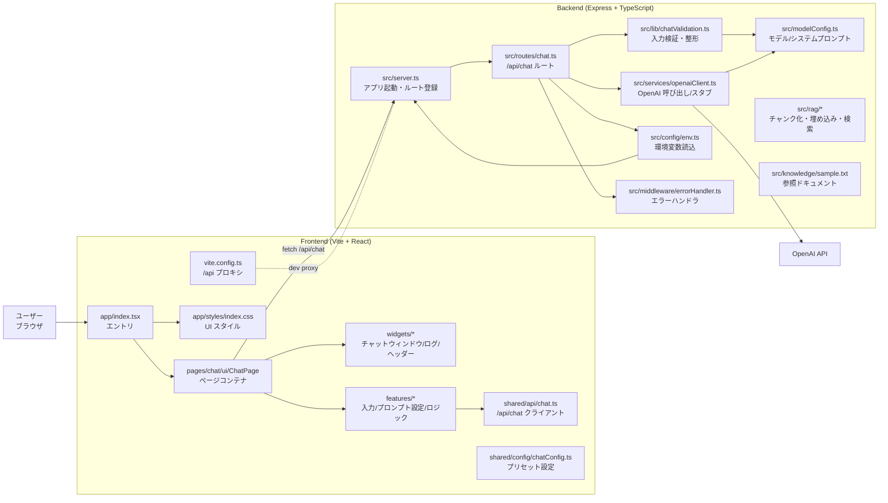

# llm-playground

LLM を使った簡易チャットアプリ（backend: Express + TypeScript / frontend: Vite + React + TypeScript）。

## 技術スタック

- バックエンド: Node.js / Express / OpenAI SDK / TypeScript
- フロントエンド: Vite / React 18 / TypeScript
- スタイル: シンプルな CSS（`frontend/src/app/styles/index.css`）
- 開発ポート: API `http://localhost:3001`、UI `http://localhost:5173`

## ディレクトリ構成

```
llm-playground/
├─ backend/            # API サーバー一式（Express, OpenAI 連携）
│  ├─ src/
│  │  ├─ config/          # 環境変数の読込・正規化
│  │  ├─ routes/          # API ルート定義（/api/chat など）
│  │  ├─ lib/             # 入力バリデーションなどの共通ロジック
│  │  ├─ services/        # 外部サービス連携（OpenAI クライアント）
│  │  ├─ middleware/      # 共通ミドルウェア（エラーハンドラ等）
│  │  ├─ knowledge/       # 参照ドキュメントと設定
│  │  ├─ rag/             # チャンク分割・埋め込み・検索ロジック
│  │  ├─ types/           # 型定義
│  │  ├─ modelConfig.ts   # モデル名・デフォルトプロンプト
│  │  └─ server.ts        # アプリ起動とルーティング設定
│  └─ dist/             # ビルド成果物（tsc / tsc-alias 実行後）
├─ frontend/           # チャット UI（Vite + React, Feature-Sliced Design）
│  ├─ src/
│  │  ├─ app/              # エントリ/App構成・グローバルスタイル
│  │  ├─ pages/chat-page/  # ページコンテナ（状態・送信処理）
│  │  ├─ features/         # UI＋ロジック単位の機能（入力フォーム、プロンプト設定）
│  │  ├─ widgets/          # ページを構成する大きめ部品（チャットログ、ヘッダー）
│  │  ├─ entities/         # ドメイン型（メッセージ、プリセット）
│  │  ├─ shared/api/       # `/api/chat` クライアント
│  │  ├─ shared/config/    # プロンプトプリセットなどの設定
│  │  └─ app/styles/       # グローバルスタイル
│  └─ vite.config.ts   # `/api` のバックエンドプロキシ設定
└─ README.md           # 本ドキュメント
```

### Backend コード構成（backend/src 配下）

- `server.ts`: エントリーポイント。ミドルウェア登録、`/api` ルート、`/health`、エラーハンドラの組み立て。
- `config/env.ts`: `PORT` と `OPENAI_API_KEY` の読み込み・正規化。
- `routes/chat.ts`: `/api/chat` のルーティング。`useKnowledge` フラグを見て RAG 検索結果を組み込む。
- `rag/`: RAG 用ユーティリティ。`loader.ts`（チャンク分割）、`embeddings.ts`（OpenAI で埋め込み生成）、`search.ts`（コサイン類似度で上位チャンク取得）、`types.ts`（型）。
- `knowledge/`: 参照ドキュメント（`sample.txt`）と設定。ビルド時に `dist/knowledge` へコピーされる。
- `lib/chatValidation.ts`: リクエストの検証・整形（role チェック、空文字の排除、system プロンプト補完）。
- `services/openaiClient.ts`: OpenAI クライアント生成とチャット API 呼び出し。API キー未設定時はスタブ応答。
- `middleware/errorHandler.ts`: 共通エラーハンドラ。`HttpError` はステータス付き、それ以外は 500 にフォールバック。
- `types/chat.ts`: チャットメッセージとリクエストボディの型定義。
- `modelConfig.ts`: デフォルトのモデル名とシステムプロンプト。

### Frontend コード構成（Feature-Sliced Design）

- `src/app/index.tsx`: アプリのエントリ。グローバルスタイル読み込みとページマウント。
- `src/pages/chat/ui/ChatPage.tsx`: ページコンテナ。チャットウィジェットを配置する薄いページ。
- `src/widgets/chat-window/ui/ChatWindow.tsx`: チャット画面全体のUIを構成（ヘッダー、ログ、入力、設定）。
- `src/features/chat/model/useChat.ts`: チャット状態管理・送信処理のロジック。
- `src/features/chat/ui/ChatForm.tsx`: 入力フォームと送信ボタン。システム設定スロット付き。
- `src/features/chat/ui/SystemPromptSettings.tsx`: プリセット選択、カスタムプロンプト、RAGトグル。
- `src/widgets/chat-log/ui/ChatLog.tsx`: メッセージ履歴表示。
- `src/widgets/header/ui/Header.tsx`: ヒーローヘッダー。
- `src/entities/message/`: メッセージ/ロール/プリセットIDの型定義。
- `src/shared/api/chat.ts`: `/api/chat` クライアント。
- `src/shared/config/chatConfig.ts`: プロンプトプリセット、デフォルトプロンプト、エンドポイント。
- `src/app/styles/index.css`: 全体レイアウト・フォーム・メッセージリストなどのスタイル。
- `vite.config.ts`: フロントの開発サーバーで `/api` をバックエンド (http://localhost:3001) へプロキシする設定。

## アーキテクチャ構成（Mermaid）



## 機能概要

- `POST /api/chat`: `{ messages: ChatMessage[], systemPrompt?: string }` を受け取り、OpenAI (`gpt-5-mini`) で応答を返す
  - API キー未設定時はスタブで固定メッセージを返す
- `GET /health`: ヘルスチェック
- フロントエンド: 単一ページで入力 → `/api/chat` に送信 → 応答表示

## 使い方

### 前提

- Node.js 18+ 推奨
- OpenAI API キー（`backend/.env` に設定）

### セットアップ

```bash
# backend
cd backend
npm install
npm run dev
npm run build # dist/server.js を生成（必要なら）

# frontend
cd ../frontend
npm install
npm run dev  # http://localhost:5173
```

バックエンドは `http://localhost:3001`、フロントエンドは `http://localhost:5173` で起動します。フロントエンドからの `/api` リクエストは Vite の proxy 設定でバックエンドに転送されます。

### 環境変数

- `backend/.env`
  - `OPENAI_API_KEY`: 必須。未設定時はスタブ応答。
  - `PORT`: 任意。指定しない場合は 3001。

### 備考

- API キーを設定しない場合、バックエンドはスタブの応答を返します。
- `/health` にアクセスするとヘルスチェックができます。
